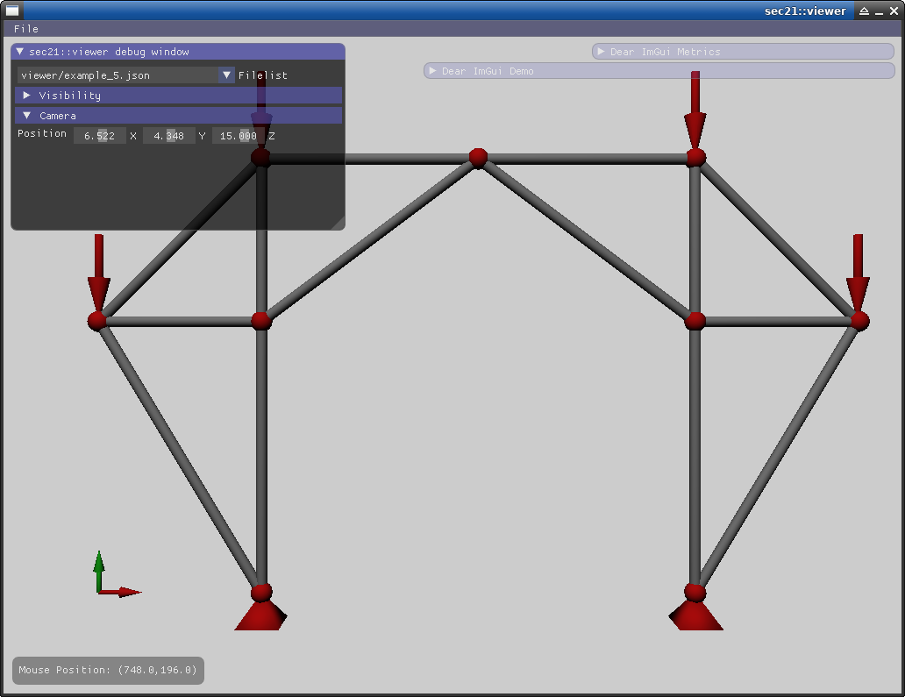
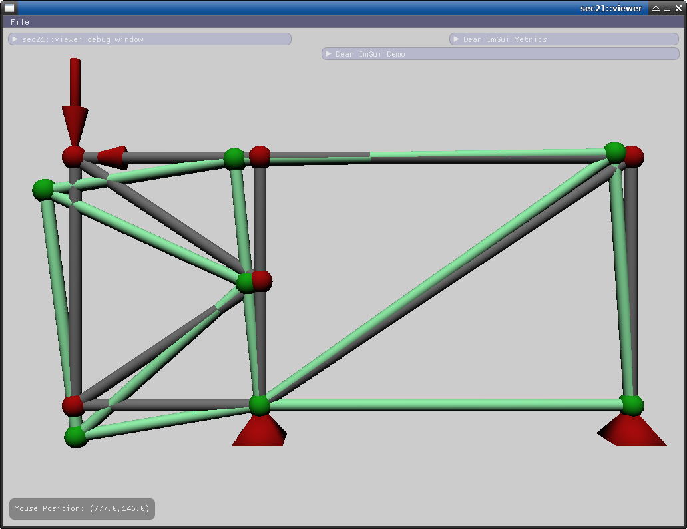

# sec21::viewer

**sec21::viewer** is a tiny and fast viewer to visualize the structural analysis inputdata used by this project. After the calculation the program can also display the resulting deformation.

## Dependencies

* EnTT https://github.com/skypjack/entt
* SDL2 https://www.libsdl.org/
* glm https://glm.g-truc.net/0.9.9/index.html
* spdlog https://github.com/gabime/spdlog
* GLEW http://glew.sourceforge.net/
* nlohmann json https://github.com/nlohmann/json

## Screenshots

View inputdata

Deformed-System

